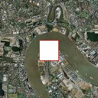

# Inpaint Object Remover
This is the implementation of the algorithm described in the paper "Region Filling and Object Removal by
Exemplar-Based Image Inpainting" by A. Criminisi et al.

## Setup
Requires python 3.5 or newer. You can download it [here](https://www.python.org/downloads/).

### Linux and Mac OS X
Get inside the project's directory, activate your conda environment(if it`s necessary) and run:
```
pip install -r requirements.txt
```
to install the dependencies.

### Windows
Recommend to use Anaconda to manage your virtual environments

After install this, inside the project's directory and activate your conda environment, run:
```
pip install -r requirements.txt
```
to install the other dependencies.

## How to use
Inside the project's directory run:
```
python __main__.py [-h] [-ps PATCH_SIZE] [-o OUTPUT] [-p] [-i INPUT_IMAGE] [-m MASK]
```
You can also pass the `-p` argument to watch the image being created. For example, use:
```
python __main__.py -i ../resources/image1.jpg -m ../resources/mask1.jpg
```
to process image1 inside resources folder using mask1 while printing each result. I provided some images from the paper inside the resources folder.

Use `python __main__.py -h` to show the available arguments.

## Performance

It proformance well on a small scale, however, with scale increasing, it gets worst.

Some reslut of repair:

result of image2

 

result of image3

 

result of image9


## Anvanced version

An anvanced version of this programme has been posted on here, it performances better than before.